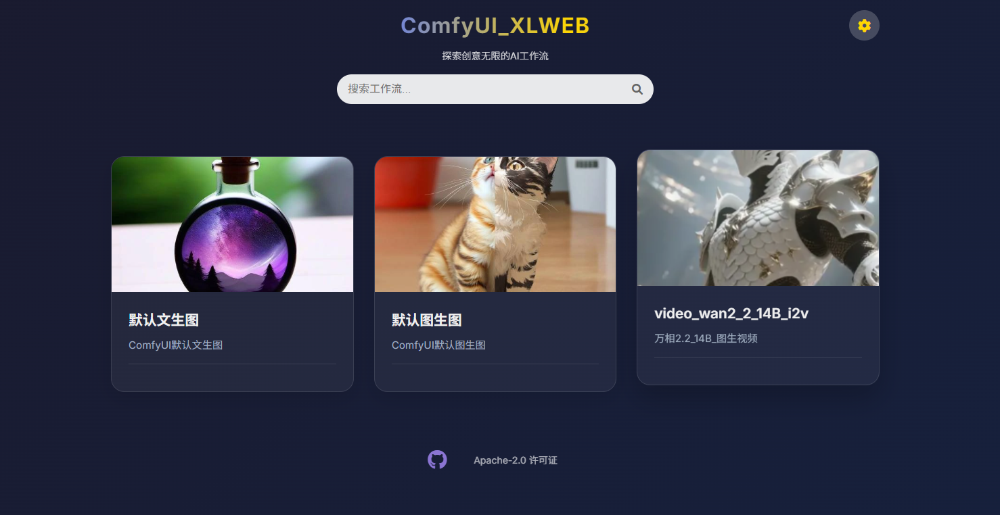
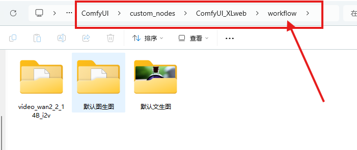

# ComfyUI XLWeb 插件

一个优雅的ComfyUI网页前端，简化复杂的节点工作流。




## 功能特性

- 🌐 **网页界面**: 基于浏览器的ComfyUI前端界面
- 🎨 **简化工作流**: 将复杂节点隐藏在直观的UI后面
- 📝 **文本输入**: 支持文本提示词和描述
- 🖼️ **图像输入**: 轻松上传和处理图像
- 🎬 **视频输入**: 支持视频文件处理
- 🌍 **多语言支持**: 支持简体中文、繁体中文、英文、日文、韩文、法文、德文、西班牙文、俄文、阿拉伯文、印地文
- ⚙️ **可配置**: 简单的服务器配置

## 安装

1. 将插件克隆或下载到ComfyUI自定义节点目录：
   ```bash
   cd ComfyUI/custom_nodes
   ```
   ```bash
   git clone https://github.com/853587221/ComfyUI_xlweb.git
   ```

## 使用说明

### 设置工作流

1. **导出API文件**: 在ComfyUI中，转到`程序菜单 → 档案 → 导出API文件`
2. **创建文件夹**: 在`ComfyUI/custom_nodes/ComfyUI_xlweb/workflow/`目录下，新建一个文件夹并命名

3. **添加API文件**: 将导出的API文件放入新文件夹中
4. **个性化设置（可选）**:
   - 添加`txt`文件并编辑描述词
   - 添加图像作为前端卡片预览图

### 重要提示

- 🎯 **使用官方节点**: 目前支持的控件较少，建议使用：
  - 官方的"加载图像"节点
  - 官方的"加载视频"节点
  - 官方的"保存图像"节点  
  - 官方的"保存视频"节点

- 🔄 **先测试**: 在添加API文件之前，务必先在ComfyUI中成功运行工作流

### 访问界面

在浏览器中打开：
```
http://你的comfyui地址/xlweb
```

示例：
```
http://localhost:8188/xlweb
http://192.168.1.100:8188/xlweb
```

### 服务器配置

1. 在主页面点击设置按钮（齿轮图标）
2. 可以选择是否修改服务器IP地址指向你的ComfyUI后端，
   默认会跟随当前comfyui地址，如果连接失败会自动调回当前comfyui地址，
   并确保防火墙允许8188端口访问。
3. 测试连接确保一切正常工作

## 文件夹结构

```
ComfyUI_xlweb/
├── workflow/                 # 工作流存储
│   ├── my_workflow/          # 自定义工作流文件夹
│   │   ├── api_file.json     # 导出的API文件
│   │   ├── description.txt   # 可选描述文件
│   │   └── preview.webp      # 可选预览图像
│   └── default_workflow/     # 示例工作流
├── app.js                    # 主应用逻辑
├── index.html                # 主界面
├── comfyui-interface.html   # ComfyUI工作流界面
└── interface-script.js       # 界面功能
```

## 支持的输入格式

插件支持多种服务器地址格式：
- `localhost:8188`
- `http://192.168.1.100:8188`
- `https://your-domain.com/`  
- `[::1]:8188` (IPv6)
- `2001:db8::1` (IPv6)

## 故障排除

### 连接问题

1. **检查ComfyUI状态**: 确保ComfyUI在指定端口运行
2. **验证IP地址**: 仔细检查设置中的服务器地址
3. **测试连接**: 使用设置中的"测试连接"按钮

### 工作流问题

1. **先在ComfyUI测试**: 导出前务必在ComfyUI中测试工作流
2. **使用官方节点**: 使用官方的加载/保存节点确保可靠性
3. **检查API导出**: 确保API导出包含所有必要节点

## 开发

本插件使用现代Web技术：
- HTML5, CSS3, JavaScript (ES6+)
- Fetch API用于服务器通信
- LocalStorage用于设置持久化
- 响应式设计支持移动设备

## 许可证

MIT 许可证 - 欢迎用于你的项目并进行修改。

## 支持

如有问题和疑问，请查看：
- ComfyUI文档
- 插件GitHub问题页面  
- 社区论坛
- 微信群


-----------------------------------------------------------------------------------------------------------------

# ComfyUI XLWeb Plugin (English)

An elegant web frontend for ComfyUI that simplifies complex node workflows.


## Features

- 🌐 **Web Interface**: Browser-based ComfyUI frontend interface
- 🎨 **Simplified Workflows**: Hide complex nodes behind intuitive UI
- 📝 **Text Input**: Support for text prompts and descriptions
- 🖼️ **Image Input**: Easy image upload and processing
- 🎬 **Video Input**: Support for video file processing
- 🌍 **Multi-language Support**: Supports Simplified Chinese, Traditional Chinese, English, Japanese, Korean, French, German, Spanish, Russian, Arabic, Hindi
- ⚙️ **Configurable**: Simple server configuration

## Installation

1. Clone or download the plugin to ComfyUI custom nodes directory:
   ```bash
   cd ComfyUI/custom_nodes
   ```
   ```bash
   git clone https://github.com/853587221/ComfyUI_xlweb.git
   ```

## Usage Instructions

### Setting up Workflows

1. **Export API File**: In ComfyUI, go to `Program Menu → File → Export API File`
2. **Create Folder**: Create a new folder in `ComfyUI/custom_nodes/ComfyUI_xlweb/workflow/` directory and name it

3. **Add API File**: Place the exported API file into the new folder
4. **Personalization (Optional)**:
   - Add a `txt` file and edit descriptions
   - Add images as frontend card preview images

### Important Notes

- 🎯 **Use Official Nodes**: Currently supports limited controls, recommend using:
  - Official "Load Image" node
  - Official "Load Video" node
  - Official "Save Image" node
  - Official "Save Video" node

- 🔄 **Test First**: Make sure to successfully run the workflow in ComfyUI before adding API files

### Accessing the Interface

Open in browser:
```
http://your-comfyui-address/xlweb
```

Examples:
```
http://localhost:8188/xlweb
http://192.168.1.100:8188/xlweb
```

### Server Configuration

1. Click the settings button (gear icon) on the main page
2. You can choose whether to modify the server IP address to point to your ComfyUI backend,
   by default it will follow the current ComfyUI address, if connection fails it will automatically revert to the current ComfyUI address,
   and ensure firewall allows port 8188 access.
3. Test connection to ensure everything works properly

## Folder Structure

```
ComfyUI_xlweb/
├── workflow/                 # Workflow storage
│   ├── my_workflow/          # Custom workflow folder
│   │   ├── api_file.json     # Exported API file
│   │   ├── description.txt   # Optional description file
│   │   └── preview.webp      # Optional preview image
│   └── default_workflow/     # Example workflow
├── app.js                    # Main application logic
├── index.html                # Main interface
├── comfyui-interface.html   # ComfyUI workflow interface
└── interface-script.js       # Interface functionality
```

## Supported Input Formats

The plugin supports various server address formats:
- `localhost:8188`
- `http://192.168.1.100:8188`
- `https://your-domain.com/`
- `[::1]:8188` (IPv6)
- `2001:db8::1` (IPv6)

## Troubleshooting

### Connection Issues

1. **Check ComfyUI Status**: Ensure ComfyUI is running on the specified port
2. **Verify IP Address**: Carefully check the server address in settings
3. **Test Connection**: Use the "Test Connection" button in settings

### Workflow Issues

1. **Test in ComfyUI First**: Always test workflows in ComfyUI before exporting
2. **Use Official Nodes**: Use official load/save nodes for reliability
3. **Check API Export**: Ensure API export contains all necessary nodes

## Development

This plugin uses modern web technologies:
- HTML5, CSS3, JavaScript (ES6+)
- Fetch API for server communication
- LocalStorage for settings persistence
- Responsive design with mobile support

## License

MIT License - Feel free to use in your projects and modify.

## Support

For questions and issues, please check:
- ComfyUI documentation
- Plugin GitHub issues page
- Community forums
- WeChat Group


---
